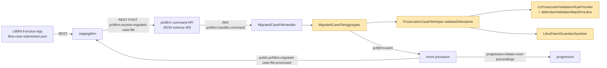

# 02 — Design

- **Story:** [DD-43501](https://tools.hmcts.net/jira/browse/DD-43501) (epic
  [DD-32995](https://tools.hmcts.net/jira/browse/DD-32995))
- **Repo:** `cpp-context-prosecution-casefile-dlrm` (`pcfdlrm`), base `team/libra1` @ `f5c3f4d`
- **Inputs:** `00-input-brief.md`, `01-requirements.md` (authoritative; Q2 and Q11 resolved).
- **ADR:** [`docs/pipeline/adrs/ADR-DD-43501-libra-defendant-validation-outcomes.md`](../adrs/ADR-DD-43501-libra-defendant-validation-outcomes.md)
- **Change scope:** command side only (`pcfdlrm-domain-aggregate`). No change to RAML, JSON
  schemas, subscription descriptors, public publications, event listener, viewstore or
  processor.

> Paths below are relative to
> `pcfdlrm-domain/pcfdlrm-domain-aggregate/src/main/java/uk/gov/moj/cpp/pcfdlrm/` unless they
> start with a module name or another repo. Line numbers are on `team/libra1` @ `f5c3f4d`.
> Facts about the upstream feed come from `cpp-context-stagingdlrm` `team/libra1` @ `0b678de`.

## Summary

This change adds LIBRA-only parent/guardian validation to the existing `pcfdlrm` CQRS context.
It is a change inside an existing context, so no new pattern or service is needed. Three
command-side pieces carry it:

1. A **LIBRA guardian rule set**, chosen by source system in `CcProsecutionValidationRuleProvider`.
2. A **LIBRA guardian sanitiser** in `ProsecutionCaseFileHelper`. It runs next to the
   XHIBIT-only `applyRuleToDefendantFields` and does not change it.
3. A **LIBRA defendant-level rejection path** in `MigratedCaseFileAggregate`. It reuses the
   existing `MigratedCaseFileProcessed(processingIsSuccessful=false)` →
   `public.pcfdlrm.migrated-case-file-processed` path.

No event or schema contract changes.

The investigation also found **several facts that contradict or empty out parts of the
requirements**. The one that most needs action is F-2: the LIBRA feed cannot carry an
organisation address at all. Q18 resolved: such cases are rejected. See [Findings that contradict the requirements](#findings-that-contradict-the-requirements).

## Pattern & rationale

Rubric bucket: **"New capability inside an existing context → extend the existing
`cpp-context-*`."** The state (the migrated case and its accept/reject outcome) is already owned
by `MigratedCaseFileAggregate`, and the outcome contract already exists. No new bounded context,
service, event or projection is justified. Modern by Default does not apply, because this is
maintenance of an existing legacy context that is explicitly allowed by the strategic direction.

## Bounded context & data ownership

- **Owner:** `pcfdlrm`, aggregate `MigratedCaseFileAggregate` (one stream per `caseId`).
- **Invariant added:** a LIBRA case (channel `DLRM_MIGRATION`, initiation code S/C/Q) is not
  accepted while any defendant's guardian has a REJECT outcome. If it is accepted, the defendants
  it stores and forwards carry no guardian value that failed a NULL rule, and every individual
  guardian has a CP gender.
- **Cross-context touch points (unchanged contracts):**
  - inbound `pcfdlrm.receive-migrated-case-file` (REST, from `stagingdlrm`)
  - outbound `public.pcfdlrm.migrated-case-file-processed` (consumed by `stagingdlrm`, and declared for `progression`)
  - `progression.initiate-court-proceedings`, which carries the sanitised defendants

## Applicability (scope predicate)

One static predicate, `LibraParentGuardianScope.applies(channel, migrationSourceSystemName, initiationCode)`,
is used by the provider, the helper and (indirectly) the aggregate. It returns true only when:

- `channel == DLRM_MIGRATION`,
- `"LIBRA".equals(migrationSourceSystemName)`. This is an exact match, mirroring `isXhibit` at
  `aggregate/MigratedCaseFileAggregate.java:513-515`. An absent source system is not LIBRA.
- the **resolved** initiation code is in `{S, C, Q}`. These are `CaseType.SUMMONS/CHARGE/REQUISITION`
  (`validation/CaseType.java`). The resolved code is the defendant's code when it is a valid
  `InitiationCode`, otherwise the case code. This is the same resolution as
  `ProsecutionCaseFileHelper.java:93-94`.

**Requisition is `Q`, not `R`** (see F-1). `J` (SJP), `R` (Remittance), `O` and unknown codes keep
today's behaviour. Whether the guardian block is present (FR-002) is checked inside each rule,
not in the predicate.

## Components

| # | File | New / changed | Purpose |
|---|---|---|---|
| C1 | `validation/provider/CcProsecutionValidationRuleProvider.java` | Changed | New 4-arg `getDefendantValidationRules(initiationCode, channel, isGroupCase, sourceSystemName)`. The existing 3-arg overload delegates with `null`, so its behaviour is unchanged. New `defendantValidationMapDlrmLibra` keyed **S, C, Q** only. |
| C2 | `validation/rules/defendant/PostCodeValidationRule.java` | Changed | New constructor `PostCodeValidationRule(boolean validateParentGuardianPostCode)`. The no-arg constructor stays `true`, so XHIBIT, SPI, MCC and LIBRA J/R/O keep today's behaviour. |
| C3 | `validation/rules/defendant/parentguardian/` (new package) | New | LIBRA guardian rules, the shape resolver, the shape gate, the redacting decorator and the gender code mapping (table below). |
| C4 | `validation/rules/defendant/parentguardian/LibraParentGuardianOutcomes.java` | New | The single table of outcomes: `ProblemCode` → `REJECT` / `NULL` / `DEFAULT`, plus field key → nulling function. Both the sanitiser and the reject collection read it. |
| C5 | `ProsecutionCaseFileHelper.java` | Changed | New `validateDefendants(...)` returns `DefendantValidationOutcome`. It replaces `validateDefendantErrors(...)`, which is removed; the aggregate and the existing helper tests call `validateDefendants(...)` instead. LIBRA scope skips the generic guardian-gender check and runs the sanitiser. |
| C6 | `DefendantValidationOutcome.java` (package `uk.gov.moj.cpp.pcfdlrm`, next to `ProsecutionCaseFileHelper`) | New | A hand-written value class (like `DefendantsWithReferenceData`), not a generated schema class: `MigratedDefendantWithProblem` plus `List<Problem> libraGuardianRejections`, in defendant order. |
| C7 | `aggregate/MigratedCaseFileAggregate.java` | Changed | New `hasLibraParentGuardianRejections(...)` after `hasOffenceProblems(...)`. It emits one `MigratedCaseFileProcessed(false)`. |
| C8 | `validation/ProblemCode.java`, `validation/rules/FieldName.java`, `validation/Constants.java` | Changed (additive) | New codes, field keys and regexes (lists below). |

### C1 — Scoping the rule set to LIBRA without touching XHIBIT, SPI or MCC

Today `DLRM_MIGRATION` resolves to `defendantValidationMapDlrm`, which is the same object as
`defendantValidationMapSpi` (`CcProsecutionValidationRuleProvider.java:310`, `:338-339`).
`getDefendantValidationRules` has no source-system parameter (`:330-342`), and XHIBIT also uses
`DLRM_MIGRATION`, so the channel alone cannot tell LIBRA from XHIBIT.

The design:

```text
getDefendantValidationRules(code, channel, isGroupCase)                       // unchanged, delegates with null
getDefendantValidationRules(code, channel, isGroupCase, sourceSystemName)     // new
  if LibraParentGuardianScope.applies(channel, sourceSystemName, code)
      return defendantValidationMapDlrmLibra.get(code)                        // S, C, Q only
  else  existing branch logic, unchanged                                      // SPI / MCC / CIVIL / DLRM / default
```

`defendantValidationMapDlrmLibra` for each of S, C and Q is the list below. It follows the
precedent of `COMMON_CASE_RULE_SET_LIBRA` at `:126-131`.

1. `COMMON_DEFENDANT_RULE_SET` minus the five generic guardian rules
   (`ParentGuardianDateOfBirthValidationRule`, `ParentGuardianObservedEthnicityValidationAndEnricherRule`,
   `ParentGuardianSelfDefinedEthnicityValidationAndEnricherRule`,
   `ParentGuardian{Primary,Secondary}EmailAddressValidationRule`). It is built by filtering the
   existing list, not by copying it, so it keeps exact parity with the rest of the list. That
   includes the duplicated `CourtReceivedToCodeCourtValidationRules` at `:254` and `:256`.
2. `SPI_DEFENDANT_RULE_SET` with `PostCodeValidationRule` replaced by
   `new PostCodeValidationRule(false)`. Defendant and defendant-individual postcode checks stay.
   The guardian postcode moves to the LIBRA rule.
3. The existing per-code set (`SUMMONS_DEFENDANT_RULE_SET` / `CHARGE_DEFENDANT_RULE_SET` /
   `REQUISITION_DEFENDANT_RULE_SET`).
4. `LIBRA_PARENT_GUARDIAN_RULE_SET` (C3).

`defendantValidationMapDlrm`, `defendantValidationMapSpi` and `defendantValidationMapMCC` are
not modified.

### C3 — LIBRA guardian rules

All rules implement `ValidationRule<DefendantWithReferenceData, ReferenceDataQueryService>`.
Each entry in `LIBRA_PARENT_GUARDIAN_RULE_SET` is wrapped as
`ParentGuardianShapeGate.onlyFor(shape, rule)`, so a rule runs only when
`ParentGuardianShape.of(pgi)` returns that shape. `ParentGuardianShape.of` works like this:

- **INDIVIDUAL** if any of `dateOfBirth`, `gender`, `personalInformation`,
  `selfDefinedEthnicity` or `observedEthnicity` is non-null and, for strings, non-blank.
  `personalInformation` counts as present if any field under it is non-blank.
- **ORGANISATION** if not INDIVIDUAL and any of `organisationName`, `companyTelephoneNumber` or
  `address` (with a non-blank field) is present.
- **ABSENT** otherwise (FR-002, Q4).

The generated `ParentGuardianInformation` flattens both `oneOf` shapes into one class (fields seen
in the generated sources). The `oneOf` with `additionalProperties: false` stops a valid payload
from mixing the shapes, so the precedence rule "INDIVIDUAL wins" only applies to malformed data.

| Rule (new unless stated) | Shape | Checks | Problem code | Outcome |
|---|---|---|---|---|
| `LibraParentGuardianTelephoneValidationRule` | IND | Each of `contactDetails.work/home/mobile` against `Constants.CP_TELEPHONE` `^[0-9+ \-]{10,}$` | `PARENT_GUARDIAN_WORK_TELEPHONE_INVALID` / `_HOME_` / `_MOBILE_` (new) | NULL (FR-004) |
| `LibraParentGuardianTelephoneValidationRule` (same class, ORG mode) | ORG | `companyTelephoneNumber`, same regex | `PARENT_GUARDIAN_COMPANY_TELEPHONE_INVALID` (new) | NULL (FR-014) |
| `LibraParentGuardianEmailValidationRule` | IND | Each of `primaryEmail` / `secondaryEmail` against `Constants.LIBRA_GUARDIAN_EMAIL` `^[0-9A-Za-z'._-]{1,127}@[0-9A-Za-z'._-]{1,127}$` | `DEFENDANT_PARENT_GUARDIAN_PRIMARY_EMAIL_ADDRESS_INVALID` / `_SECONDARY_` (reused) | NULL (FR-005) |
| `RedactingValidationRule.of(new ParentGuardianDateOfBirthValidationRule())` | IND | existing future-date check (Europe/London) | `DEFENDANT_PARENT_GUARDIAN_DATE_OF_BIRTH_IN_FUTURE` (reused) | NULL (FR-006) |
| `RedactingValidationRule.of(new ParentGuardianObservedEthnicityValidationAndEnricherRule())` | IND | existing ref-data check, top-level `observedEthnicity` | `DEFENDANT_PARENT_GUARDIAN_OBSERVED_ETHNICITY_INVALID` (reused) | NULL (FR-008, see F-4) |
| `RedactingValidationRule.of(new ParentGuardianSelfDefinedEthnicityValidationAndEnricherRule())` | IND | existing ref-data check | `DEFENDANT_PARENT_GUARDIAN_SELF_DEFINED_ETHNICITY_INVALID` (reused) | NULL (FR-009) |
| `LibraParentGuardianGenderValidationRule` | IND | `LibraGenderCode.normalise(gender)` is empty, meaning absent, blank or unmappable | `PARENT_GUARDIAN_GENDER_INVALID` (reused) | DEFAULT `NOT_KNOWN` (FR-007) |
| `LibraIndividualParentGuardianAddressValidationRule` | IND | `personalInformation.address.address1` missing (no `personalInformation`, no `address`), blank, or over 35 characters | `PARENT_GUARDIAN_ADDRESS1_MISSING_OR_INVALID` (new) | **REJECT** (FR-010) |
| (same rule) | IND | `address2`–`address5` over 35 characters | `PARENT_GUARDIAN_ADDRESS_LINE_INVALID` (new; the field key identifies the line) | NULL (FR-011) |
| (same rule) | IND | `postcode` non-blank and (does not match `POST_CODE_REGEX` and does not match `NO_FIXED_ABODE_POST_CODE`, or is over 8 characters) | `INVALID_GUARDIAN_POST_CODE` (reused) | **REJECT** (FR-012) |
| `LibraOrganisationParentGuardianAddressValidationRule` | ORG | `address.address1` missing (no `address`), blank, or over 35 characters | `PARENT_GUARDIAN_ORGANISATION_ADDRESS1_MISSING_OR_INVALID` (new) | **REJECT** (FR-015, see F-2) |
| (same rule) | ORG | `address2`–`address5` over 35 characters | `PARENT_GUARDIAN_ORGANISATION_ADDRESS_LINE_INVALID` (new) | NULL (FR-016) |
| (same rule) | ORG | `postcode`, same test as the individual postcode | `INVALID_GUARDIAN_ORGANISATION_POST_CODE` (new) | NULL (FR-017) |

Not implemented as rules, by design:

- **Surname (FR-003).** Schema only (`personal-information.json` `required: lastName`, `maxLength: 35`).
  FR-021 lists "new codes … surname", but FR-003 says there is no new business rule. FR-003 wins,
  so no surname code is added.
- **`organisationName` (FR-013).** Schema only (`maxLength: 255`), with no youth condition (Q2 resolved).

Supporting classes in the same package:

| Class | Role |
|---|---|
| `ParentGuardianShape` | enum `INDIVIDUAL / ORGANISATION / ABSENT` plus `of(ParentGuardianInformation)` |
| `ParentGuardianShapeGate` | decorator that runs the delegate only for one shape |
| `RedactingValidationRule` | decorator that replaces each `ProblemValue.value` with its `key` (privacy, see §6) |
| `LibraGenderCode` | `normalise(String) → Optional<String>`. `"0"`→`NOT_KNOWN`, `"1"`→`MALE`, `"2"`→`FEMALE`, `"9"`→`NOT_SPECIFIED` (trimmed). Any `uk.gov.justice.core.courts.Gender` name (case-insensitive) is returned unchanged. Anything else gives `empty`. Used by both the rule and the sanitiser, so they cannot disagree. |
| `LibraParentGuardianOutcomes` | C4: the code → outcome table and the field-key → nulling-function map |

The new LIBRA rules build problems through one factory that sets `ProblemValue(null, fieldKey, fieldKey)`.
The value carries the field path and never the data (§6).

### Blank values within a present block (design decision D-1)

- Blank `postcode`: absent, so ACCEPT. This is FR-012, and also how `PostCodeValidationRule` behaves today (`isBlank`, `:72-77`).
- Blank `gender`: DEFAULT `NOT_KNOWN` with a warning (FR-007).
- Blank `address1`: REJECT (FR-010, FR-015).
- Any other blank optional value (phone, email, ethnicity, address line): **present and invalid,
  so NULL-AND-WARN**. The wrapped ref-data rules already behave this way (they only skip `null`),
  and removing an empty string loses no data. The alternative, "blank = absent, left
  untouched", would need a second code path in the wrapped rules for no business gain.

### C5 — The sanitise step (where it lives)

The XHIBIT equivalent is `applyRuleToDefendantFields` (`ProsecutionCaseFileHelper.java:212-253`).
It is reached only inside the problems-present branch and only for `"XHIBIT"` (`:118-120`). LIBRA
gets its own step, `LibraParentGuardianSanitiser.sanitise(MigratedDefendant.Builder, List<Problem>)`,
called **outside** the problems-present `if`. It has to run when there are no problems too,
because valid numeric gender codes are mapped without a warning (AC-017).

Per-defendant flow in `validateDefendants(...)`. Steps marked **new** are LIBRA-scope only.

```text
initiationCode   = resolved code (:93-94)
inScope          = LibraParentGuardianScope.applies(channel, sourceSystem, initiationCode)      // new
problems         = validate(..., getDefendantValidationRules(initiationCode, channel, isGroupCase, sourceSystem))  // 4-arg
validateGenderAndLanguage(defendant, problems, /*checkParentGuardianGender*/ !inScope)           // flag new; XHIBIT etc. unchanged
validateCustodyTimeLimit(defendant, problems)                                                     // unchanged
if problems not empty -> DefendantProblem + DefendantValidationFailed (:102-117, unchanged)
                         if XHIBIT -> applyRuleToDefendantFields (:118-120, unchanged)
else                  -> DefendantValidationPassed (:122-129, unchanged)
if inScope:                                                                                       // new
    LibraParentGuardianSanitiser.sanitise(builder, problems)
    rejections += problems where LibraParentGuardianOutcomes.isReject(code)
migratedDefendants.add(builder.build())
```

What `sanitise` does:

1. If the guardian is absent, do nothing.
2. **INDIVIDUAL only:** `target = LibraGenderCode.normalise(gender).orElse(NOT_KNOWN.name())`.
   Set it only if it differs from the current value, so a valid enum name stays byte-for-byte
   (AC-043). **ORGANISATION:** gender is never read or written (FR-007, Q13, AC-020).
3. For each problem whose code `LibraParentGuardianOutcomes` marks `NULL`, look up the nulling
   function by `ProblemValue.key` and apply it. Each function rebuilds the nested generated
   objects with `withValuesFrom(...).withX(null)`, the same technique as `buildMigratedDefendant`
   at `:287-306`.
4. Never touch REJECT fields. The case is rejected, so the defendant never leaves the aggregate.

Why the sanitiser is keyed on `(code, fieldKey)`: one table drives validation output, sanitising
and rejection, and it can be unit-tested on its own. This mirrors how `applyRuleToDefendantFields`
keys on `hasProblem(...)`. The XHIBIT gender default (`applyDefendantAndParentGenderRule`,
`:264-284`) and the generic `validateGenderAndLanguage` guardian check (`:347-356`) are unchanged
for every other scope.

**The generic guardian-gender check is skipped in LIBRA scope.** That check raises
`PARENT_GUARDIAN_GENDER_INVALID` for every organisation guardian, and for numeric codes. In scope,
`LibraParentGuardianGenderValidationRule` replaces it, so the code can only be raised for an
individual guardian with an unmappable gender.

### C7 — The LIBRA rejection path in the aggregate

Insert it immediately after the XHIBIT-gated `hasOffenceProblems` (`MigratedCaseFileAggregate.java:271-273`)
and before the XHIBIT case warnings (`:275`):

```text
final DefendantValidationOutcome outcome = validateDefendants(...);                   // replaces :267-269
final MigratedDefendantWithProblem migratedDefendantWithProblem = outcome.migratedDefendantWithProblem();
if (hasOffenceProblems(...))                         return apply(builder.build());   // unchanged, XHIBIT-only
if (hasLibraParentGuardianRejections(outcome, ...))  return apply(builder.build());   // new
... warnings, materials, CreationPending / Received (unchanged)
```

- **Gate.** `outcome.libraGuardianRejections()` is non-empty. That list only gets entries for
  in-scope defendants, so XHIBIT, SJP, LIBRA R/O and non-DLRM cases can never take this path.
  This matters because `INVALID_GUARDIAN_POST_CODE` is still raised as a **warning** by the
  generic `PostCodeValidationRule` for XHIBIT and LIBRA J/R/O. So the aggregate must **not**
  reject on the code alone, and the per-defendant scope is why `DefendantValidationOutcome` exists.
- **Event.** One `MigratedCaseFileProcessed` with `caseId`, `caseUrn`, `submissionId` and
  `processingIsSuccessful=false`, built the same way as the XHIBIT paths (`:424-430`).
  `MigratedCaseFileProcessedProcessor` publishes it unchanged as
  `public.pcfdlrm.migrated-case-file-processed` (`pcfdlrm-event/pcfdlrm-event-processor/.../MigratedCaseFileProcessedProcessor.java:33-51`).
- **Description.** `"Parent guardian validation failed: " + String.join(", ", distinctCodes)`.
  `distinctCodes` is a `LinkedHashSet` in defendant order, then rule order, so it is
  deterministic. Example for AC-040:
  `Parent guardian validation failed: PARENT_GUARDIAN_ADDRESS1_MISSING_OR_INVALID, INVALID_GUARDIAN_POST_CODE`.
  It contains codes only: no values and no defendant identifiers, because `stagingdlrm` forwards
  the description to the external Event Grid outcome. The per-defendant breakdown stays in the
  internal `DefendantValidationFailed` events (one per defendant, with field keys), which meets NFR-006.
- **Description constraint.** `stagingdlrm` treats a failure as a staging-context error when
  `stagingContextErrors` (`JSON_SCHEMA`, `DUPLICATE_SUBMISSION_ID`, `CASE_ALREADY_EXISTS_IN_PROGRESSION`,
  `VALIDATION_FAILED`) match the description in either direction (substring test)
  (`cpp-context-stagingdlrm/.../StagingDlrmEventProcessor.java:51-55,183`). The new text must not
  contain, or be contained in, any of those strings. The proposed text satisfies this. Add a unit
  test that pins the prefix.
- **Ordering and coexistence.** The material rejections (`:177-208`), XHIBIT case rejections
  (`:214-251`) and XHIBIT hearing rejection (`:256-265`) all run first, as today. On the reject
  path the builder already holds the per-defendant `DefendantValidationFailed` / `DefendantValidationPassed`
  events added by the helper (`:109-128`). They are kept, which matches the XHIBIT offence path.
  No `MigratedCaseValidatedWithWarnings`, `MaterialAdded`, `MigratedCaseValidatedCreationPending`
  or `MigratedCaseFileReceived` is emitted (AC-040).
- **Multi-defendant.** All defendants are validated before the decision. A single event lists
  every distinct reason across all defendants (FR-018, AC-040).
- **Aggregate state.** `apply(...)` does not handle `MigratedCaseFileProcessed` (`:129-137`), so a
  rejected stream keeps `receiveMigratedCaseFile == null`, which is the same as the existing
  rejections. A corrected re-submission is accepted on the same stream. This is existing
  behaviour and is not changed.

On the accept path nothing new is needed. The existing warning mapper (`:289-302`) turns every
LIBRA guardian NULL or DEFAULT problem into one `MigratedCaseValidatedWithWarnings`
(type "Defendant validation"). None of the new codes is in `offenceProblems` (`:114-115`). The
sanitised `migratedDefendants` already flow into `MigratedCaseValidatedCreationPending` (`:348-358`)
and `MigratedCaseFileReceived` (`:362-366`), which is FR-019.

### C8 — New constants

- **`ProblemCode`** (additive):
  - `PARENT_GUARDIAN_WORK_TELEPHONE_INVALID`
  - `PARENT_GUARDIAN_HOME_TELEPHONE_INVALID`
  - `PARENT_GUARDIAN_MOBILE_TELEPHONE_INVALID`
  - `PARENT_GUARDIAN_COMPANY_TELEPHONE_INVALID`
  - `PARENT_GUARDIAN_ADDRESS1_MISSING_OR_INVALID`
  - `PARENT_GUARDIAN_ADDRESS_LINE_INVALID`
  - `PARENT_GUARDIAN_ORGANISATION_ADDRESS1_MISSING_OR_INVALID`
  - `PARENT_GUARDIAN_ORGANISATION_ADDRESS_LINE_INVALID`
  - `INVALID_GUARDIAN_ORGANISATION_POST_CODE`

  `problem.json` types `code` as a free string, so these need no schema change.
- **`FieldName`** (additive; same `individual_parentGuardianInformation_…` style as `:31-35`, `:58`):
  - `…_personalInformation_contactDetails_work` / `_home` / `_mobile`
  - `…_personalInformation_address_address1` … `_address5`
  - `…_gender`
  - `…_companyTelephoneNumber`
  - `…_address_address1` … `_address5`
  - `…_address_postcode`

  Existing keys are reused for date of birth, ethnicities, emails and the individual postcode.
- **`Constants`** (additive):
  - `CP_TELEPHONE("^[0-9+ \\-]{10,}$")`
  - `LIBRA_GUARDIAN_EMAIL("^[0-9A-Za-z'._-]{1,127}@[0-9A-Za-z'._-]{1,127}$")`
  - `NO_FIXED_ABODE_POST_CODE("^[zZ][zZ]99 ?[0-9][a-zA-Z]{2}$")` (Q14 default)

  All three are single character classes with bounded or simple quantifiers, so they cannot
  backtrack catastrophically (NFR-004). `EMAIL` and `POST_CODE_REGEX` are unchanged.

## Contracts

- **Commands.** Unchanged: `pcfdlrm.command.receive-migrated-case-file`
  (`pcfdlrm-command/pcfdlrm-command-handler/src/raml/pcfdlrm-command-handler.messaging.raml`) and
  the REST `pcfdlrm.receive-migrated-case-file` (`pcfdlrm-command/pcfdlrm-command-api/src/raml/pcfdlrm-command-api.raml`).
  No RAML or JSON schema edits (Q11 resolved).
- **Events.** No new event and no field change.

| Event | Layer | Change |
|---|---|---|
| `pcfdlrm.events.migrated-case-file-processed` | domain → processor (`subscriptions-descriptor.yaml`) | None. New `description` text only (free string, no `maxLength`). |
| `public.pcfdlrm.migrated-case-file-processed` | processor → `public.event` (`public-publications-descriptor.yaml`) | None. Same payload shape, new description text. |
| `pcfdlrm.events.migrated-case-validated-with-warnings` | domain only (Java `@Event` class, no schema, not subscribed) | None. New `message` strings. |
| `pcfdlrm.events.defendant-validation-failed` | domain only (not subscribed) | None. New problem codes. LIBRA guardian values are redacted. |
| `MigratedCaseValidatedCreationPending` / `MigratedCaseFileReceived` | domain → processor | None. They carry sanitised defendants (fewer optional fields; gender normalised). |

- **APIs.** No change.
- **Layer check (CLAUDE.md "three layers").**
  - *Command side:* changed (C1–C8).
  - *Event listener:* still a stub. No `subscriptions-descriptor.yaml` exists
    (`pcfdlrm-event/pcfdlrm-event-listener/src/yaml` is absent), so nothing to change.
  - *Event processor:* no change. `ProsecutionCaseFileMigratedDefendantToCCDefendantConverter.buildAssociatedPersons`
    (`pcfdlrm-event/pcfdlrm-event-processor/.../convertor/...:95-117`) already null-checks every
    guardian field it reads. `getGender` (`:195-201`) returns `Optional.empty()` for unknown
    values, so it handles the nulled fields.
  - Because nothing is added or removed in a descriptor, the "subscription without schema →
    500" gotcha does not apply.

## Current behaviour when the receive payload fails JSON schema validation (recorded, not changed)

The requirements depend on this as an outcome for AC-007, AC-026a, AC-033 and AC-037a. Traced
end to end:

1. `stagingdlrm` sends `pcfdlrm.receive-migrated-case-file` from
   `StagingDlrmEventProcessor.handleMigratedCaseSubmissionReceived` through `sender.send`
   (`cpp-context-stagingdlrm/stagingdlrm-event/stagingdlrm-event-processor/.../StagingDlrmEventProcessor.java:77-123`).
   It does this over a **REST client** that `rest-client-generator-plugin` generates from the
   `pcfdlrm-command-api` `raml` classifier (`.../stagingdlrm-event-processor/pom.xml:111-124`).
   Outbound envelope validation in the sender is a no-op by default, because
   `envelope.validation.exception.handler` defaults to `EmptyValidationExceptionHandler`
   (framework `core` 17.104.0, `EnvelopeValidationExceptionHandlerProducer`).
2. In `pcfdlrm`, the framework REST adapter's `JsonSchemaValidationInterceptor` validates the body
   against `pcfdlrm.receive-migrated-case-file.json` and the schemas it references. On failure it
   throws `BadRequestException("JSON schema validation has failed on … due to …")`
   (framework `rest-adapter-core` 17.104.0, `adapter/rest/interceptor/JsonSchemaValidationInterceptor.java`).
   `BadRequestExceptionMapper` turns that into **HTTP 400** with `{"error": …, "validationErrors": …}`
   (`adapter/rest/mapper/BadRequestExceptionMapper.java`).
3. Nothing reaches `MigratedCaseFileApi` (`pcfdlrm-command/pcfdlrm-command-api/.../MigratedCaseFileApi.java:21-28`),
   the handler queue or the aggregate. **No `pcfdlrm` event is stored and no
   `public.pcfdlrm.migrated-case-file-processed` is published.**
4. In `stagingdlrm`, `DefaultRestClientProcessor.post` expects 202. Any other status throws
   `RuntimeException("… expected 202 response but got 400 …")` (framework `rest-client-core`
   17.104.0, `DefaultRestClientProcessor.java:266-272`). `handleMigratedCaseSubmissionReceived`
   does not catch it, so the exception escapes the `stagingdlrm` event-processor handler.
   - What follows comes from the framework's event-processor failure handling: the transaction is
     rolled back, and the message is redelivered and then dead-lettered under the broker's address
     settings. That configuration is in neither repo, **so this step is not verified here**.
   - No Event Grid outcome is written on this path. `sendEventToGrid` is only reached from the
     processed and error events (`StagingDlrmEventProcessor.java:126-190`).
   - **For migration operations, a `pcfdlrm` schema failure appears as a stuck or dead-lettered
     `stagingdlrm` message, not as a failed-migration outcome.** If an outcome is needed, that is
     a separate `stagingdlrm` story.
5. In practice most guardian schema failures never reach `pcfdlrm`. The LIBRA Function App
   validates `case.json` first against `stagingdlrm-azure-functions/src/main/resources/libra.case-submission.json`
   (selected in `TimerTriggerJava.java:399-410`). That schema already requires guardian
   `personalInformation` with `surname` and `address` (with `address1`), caps the address lines at 35,
   caps `organisationName` at 255, and requires `organisationName` for an organisation guardian.
   A failure there becomes a `false` outcome with `"JSON schema validation has failed: …"`.
   - The guardian schema failures that **can** reach `pcfdlrm` from LIBRA are a surname of 36–255
     characters (upstream `maxLength 255`, `pcfdlrm` `35`) and an email longer than 255.
   - AC-026a, AC-033 and AC-037a are unreachable from the LIBRA feed (upstream catches them
     first) but stay true for direct callers.

A design for the inner handler leg is not needed. `pcfdlrm.command.receive-migrated-case-file.json`
references the same `migrated-case-details.json`, so a payload that passes the API also passes the
handler's messaging validation.

## Diagrams



```mermaid
sequenceDiagram
  participant SD as stagingdlrm
  participant API as pcfdlrm command API
  participant AGG as MigratedCaseFileAggregate
  participant HLP as ProsecutionCaseFileHelper
  participant PROC as event processor
  SD->>API: POST receive-migrated-case-file (LIBRA, C)
  alt payload fails JSON schema
    API-->>SD: 400 (nothing stored; stagingdlrm throws)
  else schema OK
    API->>AGG: pcfdlrm.command.receive-migrated-case-file
    AGG->>AGG: material / XHIBIT case / XHIBIT hearing checks (unchanged)
    AGG->>HLP: validateDefendants(...)
    loop each defendant
      HLP->>HLP: LIBRA rule set (in scope), skip generic guardian gender
      HLP->>HLP: sanitise (null / default), collect REJECT codes
    end
    HLP-->>AGG: DefendantValidationOutcome
    alt any LIBRA guardian REJECT
      AGG-->>PROC: DefendantValidationFailed..., MigratedCaseFileProcessed(false, "Parent guardian validation failed: ...")
      PROC-->>SD: public.pcfdlrm.migrated-case-file-processed (false)
    else no REJECT
      AGG-->>PROC: warnings (1 per nulled/defaulted field), MaterialAdded... / MigratedCaseFileReceived (sanitised)
      PROC->>PROC: initiate-court-proceedings (sanitised guardian)
    end
  end
```

## Cross-cutting

- **AuthZ.** None. There is no new endpoint and no Drools change. The receive endpoint and
  `sendAsAdmin` are unchanged.
- **Privacy (NFR-001, Q15 default).** Today rules copy the offending value into
  `ProblemValue.value` (for example `ParentGuardianPrimaryEmailAddressValidationRule.java:33`).
  The aggregate then copies it into the warning `message` (`code + " : " + values`,
  `MigratedCaseFileAggregate.java:298`) and into `DefendantValidationFailed.problems`.
  - For LIBRA guardian problems, `RedactingValidationRule` and the new rules' problem factory set
    `value = key`, so a warning reads, for example,
    `PARENT_GUARDIAN_HOME_TELEPHONE_INVALID : [individual_parentGuardianInformation_personalInformation_contactDetails_home]`.
    That message contains the code and the field and no data.
  - `problem-value` requires `value` (`problem.json`), so carrying the key keeps the payload
    schema-valid without changing the aggregate's formatter. Changing the formatter would also
    change XHIBIT warnings.
  - The new rules log nothing.
  - **Residual, out of scope, flagged for the DPO:**
    - `DefendantValidationFailed.defendant` stores the unsanitised defendant (`ProsecutionCaseFileHelper.java:110-116`).
    - `MigratedCaseValidatedCreationPending.prosecutionWithReferenceData` stores the original
      `Prosecution`, built from the raw defendants in `MigratedCaseFileHandler.java:76-79`.

    Both are existing behaviour for every DLRM source.
- **Audit and metrics.** No new metric. Rejections are counted by the existing
  `PcfMigratedCaseFailedCounter` (`MigratedCaseFileProcessedProcessor.java:47-49`).
- **Feature toggle.** None. The behaviour is scoped by source system and initiation code, and
  is only on `team/libra1`. Unwinding is a code revert (see the ADR).
- **Correlation.** Unchanged. Events are enveloped with the command metadata
  (`MigratedCaseFileHandler.java:115-117`).
- **Determinism (NFR-003).** Validation runs only in command handling. `apply(...)` only replays
  state. The only clock is the existing Europe/London date in the date-of-birth rule.

## Deployment

- No Helm or Flux in this repo (WAR on WildFly). No Liquibase, viewstore, queue or topic change in
  `pcfdlrm-service/src/main/descriptors/resource-descriptor.yml`.
- Pipeline: PR uses `pipelines/context-verify.yaml`; `team/*` uses `pipelines/context-validation.yaml`
  with ITs.
- Rollout: no data migration. Already-stored cases are not re-validated (out of scope). Q18 confirmed
  REJECT, so LIBRA cases with organisation guardians are rejected (F-2). Tell migration operations before release.

## Test strategy (outline; test-engineer details it in Stage 4)

1. **Rule units** (`src/test/.../validation/rules/defendant/parentguardian/`), one class per rule:
   absent, valid, invalid and boundary cases.
   - Phone: 9 vs 10 characters, `(`, `.`, tab.
   - Email: local part 127 vs 128, `+`, no `@`, domain with no dot.
   - Date of birth: today vs tomorrow.
   - Gender: `0`, `1`, `2`, `9`, `3`, `X`, blank, absent, lowercase `male`.
   - `address1`: absent `personalInformation`, absent `address`, `""`, `"  "`, 35 vs 36 characters, `NFA`.
   - Postcode: `SW1A 1AA`, `SW1A1AA`, `ZZ99 9ZZ`, `NOT A POSTCODE`, blank, over 8 characters.
   - Organisation equivalents.
   - Shape gate: an organisation guardian never triggers individual rules, and the reverse.
   - Redaction: no `ProblemValue.value` equals the input data.
2. **`ParentGuardianShape`, `LibraGenderCode`, `LibraParentGuardianOutcomes`**: table-driven tests.
   Every new code is classified, and every NULL code has a nulling function.
3. **`CcProsecutionValidationRuleProviderTest`**: the LIBRA S/C/Q lists equal (COMMON minus 5
   guardian rules) + SPI (postcode without guardian) + per-code set + LIBRA set. The pinned
   assertions for XHIBIT, SPI, MCC, CIVIL and DLRM J/R/O are unchanged (for example the existing
   R fallback test at `:479-490`).
4. **`ProsecutionCaseFileHelperTest`**:
   - Sanitised defendant output for AC-042/AC-043 (exactly four warnings-worth of problems;
     everything else equal).
   - Organisation guardian: no gender problem, no gender added.
   - XHIBIT path unchanged (the existing tests at `:211`, `:241` and `:273` still pass unmodified).
5. **`MigratedCaseFileAggregateTest`**:
   - AC-040 (two defendants: one event, both codes, no Received or CreationPending).
   - The description prefix is pinned and checked against the `stagingdlrm` marker strings.
   - Ordering after the XHIBIT checks.
   - XHIBIT with an invalid guardian postcode stays a warning (AC-001).
   - LIBRA SJP with a missing `address1` is not rejected (AC-002).
   - **Fixture sweep:** `json/aggregate/migrated-case-file-received-no-materials-libra.json` has a
     guardian with no `personalInformation`. If its scenario's initiation code is S/C/Q, it now
     rejects, and the fixture needs a guardian address.
6. **IT** (`ReceiveMigratedCaseFileIT`):
   - New LIBRA C fixture for the reject journey: assert the public event `processingIsSuccessful=false`
     and the description, using the existing `verifyCaseProcessed`.
   - New LIBRA C fixture for the sanitised-accept journey: assert the guardian in
     `initiate-court-proceedings`.
   - One schema-failure case (surname of 36 characters) asserting HTTP 400. This needs a
     `makePostCall` overload, because `AbstractTestHelper.java:73` asserts 202.
   - **Existing fixtures that will flip to REJECT:** `pcfdlrm.command.receive-multiple-hearing-migrated-case-file.json`,
     `…-multiple-hearing-wc-…` and `…-with-no-hearing-…` are LIBRA `Q` cases with an individual
     guardian that has no address. They are used at `ReceiveMigratedCaseFileIT.java:70-71`, and
     the no-hearing one by the no-material test at `:259-266`. Add a guardian `address` to these
     fixtures. That brings them in line with what the real upstream sends (address required) and
     changes no expected output.
   - The three LIBRA `J` fixtures are out of scope and unaffected.

## Risks & trade-offs

1. **FR-015 would reject every LIBRA organisation-guardian case (delivery and operations, high).**
   See F-2. **Accepted:** Q18 confirmed REJECT (2026-10-02). *Remaining mitigation:* tell migration
   operations before release that LIBRA cases with organisation guardians will be rejected. The switch from REJECT to
   NULL (or to "no rule") is a one-entry change in `LibraParentGuardianOutcomes`. The upstream
   alternative (add organisation `address` to `libra.case-submission.json`) is a separate
   `stagingdlrm` story.
2. **Existing LIBRA S/C/Q fixtures and tests flip to rejection (delivery, medium).** See the
   fixture sweep in the test strategy. *Mitigation:* update the fixtures in the same PR. Do not
   weaken the rule.
3. **Scope leakage into XHIBIT or SPI (technical, medium).** *Mitigation:* a separate LIBRA map
   built by filtering, a no-arg `PostCodeValidationRule` that keeps today's behaviour, per-defendant
   reject collection (not by code), and the existing provider tests that pin rule classes per
   channel and code.
4. **Residual personal data in internal events** (privacy, see Cross-cutting). This is existing
   behaviour. *Mitigation:* DPO decision; a possible follow-up story across all DLRM sources.

**Reversibility:** this is a two-way door. There are no contract, schema or data changes. Rejected
cases are recorded only as `MigratedCaseFileProcessed(false)` and can be re-submitted after a
revert.

## Alternatives considered

- **Add the LIBRA rules to the shared `COMMON_DEFENDANT_RULE_SET`, or edit the existing guardian
  rules in place.** Rejected: it changes XHIBIT, SPI and MCC (FR-020), and the email regex and
  value redaction differ by source.
- **Leave the rule map alone and filter LIBRA problems in the helper** (drop the generic guardian
  codes, then run the LIBRA rules). Rejected: it raises and then discards problems, and it hides
  the rule set from `CcProsecutionValidationRuleProviderTest`.
- **Reject in the aggregate on problem codes alone.** Rejected: `INVALID_GUARDIAN_POST_CODE` is
  still a warning for XHIBIT and LIBRA J/R/O, so per-defendant scope must travel with the result
  (`DefendantValidationOutcome`).
- **A new rejection event or a structured reason list on the public event.** Rejected: it is a
  contract change for `stagingdlrm` and `progression` (NFR-002). The Q9 default is description text.
- **Add fields to the generated `MigratedDefendantWithProblem`.** Rejected: it means a schema edit
  for an internal value. A hand-written class is enough.
- **Change the warning formatter to print keys instead of values.** Rejected: it changes every
  XHIBIT warning. `value = key` gives the same result for LIBRA guardian problems only.

## Findings that contradict the requirements

| # | Finding (source) | Affects | Design response |
|---|---|---|---|
| F-1 | Requisition is initiation code **`Q`**. `R` is Remittance (`validation/CaseType.java`; the LIBRA enum `C,Q,J,R,S` in `libra.case-submission.json` `caseDetails.initiationCode`; the "R fallback" test at `CcProsecutionValidationRuleProviderTest.java:479-490`). | Applicability, FR-001, AC-003 | Scope is S/C/**Q**. R is excluded pending confirmation (new Q17). |
| F-2 | The LIBRA Function App schema's organisation-guardian shape has only `organisationName` (required) and `companyTelephoneNumber`, with `additionalProperties: false`. **It has no `address`** (`libra.case-submission.json` `definitions.parentGuardianInformation.oneOf[1]`). Every LIBRA organisation guardian therefore arrives without an address. | FR-015 (REJECT), FR-016, FR-017 | Implemented as specified. Q18 resolved: REJECT confirmed by the requester (2026-10-02). Risk 1. |
| F-3 | Upstream maps guardian gender integers `0/1/2/9` to `NOT_KNOWN/MALE/FEMALE/NOT_SPECIFIED` before `pcfdlrm` sees them. Other in-range integers arrive as `"3"`…`"8"` (`MigratedGender.getValueFromCode`, `MigratedCaseConvertor.java:189-201`). Gender is `required` for an individual guardian upstream. | FR-007, AC-017, AC-018 | Numeric mapping kept as defence in depth. In practice LIBRA sends `"3"`–`"8"`, which default to `NOT_KNOWN` with a warning. "Absent" is reachable only for direct callers. |
| F-4 | LIBRA sends guardian observed ethnicity as the integer `personalInformation.observedEthnicity` (`MigratedCaseConvertor.java:303`). The top-level `observedEthnicity` that FR-008 and the existing rule check is never set from LIBRA. The processor only reads the top-level field (`ProsecutionCaseFileMigratedDefendantToCCDefendantConverter.java:148-150`). | FR-008, AC-021, AC-022 | FR-008 is implemented as written (top-level). The mapping gap is raised as Q19. A fix belongs in `stagingdlrm` or a follow-up story, not here. |
| F-5 | The upstream schema already caps guardian address lines at 35 and requires `postcode` to match `ukGovPostCode`. That pattern needs exactly one space and is otherwise the same as `pcfdlrm`'s `POST_CODE_REGEX`, which allows any number of spaces. `ZZ99 9ZZ` also fails upstream. | FR-011, FR-012, Q14 | These are implemented, but cannot fire from the LIBRA feed today (defence in depth). The Q14 allowance is harmless. |
| F-6 | The processor drops organisation guardians entirely. `buildAssociatedPersons` maps a guardian only when `organisationName` is empty (`…CCDefendantConverter.java:97`). An organisation guardian **without** a name would be sent as a nameless individual person. | FR-013, FR-014, FR-016, FR-017 | Sanitising organisation fields changes nothing downstream. The nameless-person case is unreachable from LIBRA (upstream requires `organisationName`). It is a latent issue, out of scope. |
| F-7 | FR-021 says "new codes cover … surname", but FR-003 says "no new business rule". | FR-021 | FR-003 wins. No surname code. |
| F-8 | A schema failure does **not** produce a failed-migration outcome. It is an HTTP 400 that `stagingdlrm` turns into an uncaught exception (see the trace above). | AC-007, AC-026a, AC-033, AC-037a; "how it surfaces to operations" | Recorded as fact. Not changed. |

## Open questions the design depends on

| # | Question | Default used | Blocks |
|---|---|---|---|
| Q1, Q3–Q7, Q9, Q10, Q12–Q16 | As in `01-requirements.md` | As stated there. Q7 means length breaches are invalid, including postcode over 8 characters. Q15 means `value = key`. | No |
| Q17 (new) | Should LIBRA Remittance (`R`) cases get guardian rules? | No: S, C and Q only (F-1). | No |
| Q18 (new) | Given F-2, is the organisation `address1` REJECT intended? Should `stagingdlrm` add organisation `address` to the LIBRA schema first? | **Resolved 2026-10-02 by the requester: REJECT the case.** FR-015 stands as specified. Consequence accepted: until the LIBRA schema carries an organisation address, every LIBRA case with an organisation guardian is rejected. | No (resolved) |
| Q19 (new) | Should guardian observed ethnicity be validated at `personalInformation.observedEthnicity` (where LIBRA puts it), and mapped to the top-level field the processor reads? | No. FR-008 stays literal (top-level). Raise a follow-up story. | No |
| Q20 (new) | Does migration operations need a reported outcome for `pcfdlrm` schema failures (F-8)? | No change in this story. A `stagingdlrm` story if wanted. | No |

## Implementation outline

- [ ] Add the `ProblemCode`, `FieldName` and `Constants` entries (C8).
- [ ] Add the `parentguardian` package: `ParentGuardianShape`, `ParentGuardianShapeGate`,
      `RedactingValidationRule`, `LibraGenderCode`, the telephone, email, gender and two address
      rules, `LibraParentGuardianOutcomes`, `LibraParentGuardianScope`, `LibraParentGuardianSanitiser`.
- [ ] `PostCodeValidationRule(boolean)` constructor; the no-arg constructor is unchanged.
- [ ] Provider: `defendantValidationMapDlrmLibra` (S, C, Q) plus the 4-arg overload.
- [ ] Helper: `validateDefendants(...)` → `DefendantValidationOutcome`;
      `validateDefendantErrors(...)` removed; `validateGenderAndLanguage` gets the guardian-gender
      flag; call the sanitiser; collect rejections.
- [ ] Aggregate: call `validateDefendants`; add `hasLibraParentGuardianRejections`; add the
      description constant.
- [ ] Tests and fixture updates as in the test strategy. Run `mvn clean install`, then `./runIntegrationTests.sh`.
- [ ] No wildcard imports (CLAUDE.md).

## Follow-ups

- **C4 model:** no change. There are no new containers or relations.
- **ADR:** yes. See [`ADR-DD-43501-libra-defendant-validation-outcomes.md`](../adrs/ADR-DD-43501-libra-defendant-validation-outcomes.md).
  It sets the pattern that the other DD-32995 stories (non-guardian defendant fields, offences)
  are expected to reuse.
- **Possible separate stories:**
  - `stagingdlrm`: organisation guardian address in the LIBRA schema (F-2, Q18).
  - `stagingdlrm`: guardian observed-ethnicity mapping (F-4, Q19).
  - `stagingdlrm`: outcome for `pcfdlrm` 400s (F-8, Q20).
  - DLRM-wide minimisation of `DefendantValidationFailed.defendant`.
