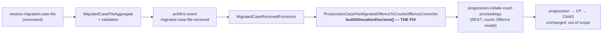

# 02 — Design

- **Story:** [DD-34852](https://tools.hmcts.net/jira/browse/DD-34852) (epic
  [DD-34850](https://tools.hmcts.net/jira/browse/DD-34850))
- **Repo:** `cpp-context-prosecution-casefile-dlrm` (`pcfdlrm`)
- **Requirements:** [`01-requirements.md`](./01-requirements.md) — authoritative for scope;
  all of OQ-1..OQ-5 resolved 2026-09-17. This document does not restate them.
- **Status:** Ready for stage 3 (user story) and implementation.

## Summary

One production line changes. `buildAllocationDecision(...)` in
`ProsecutionCaseFileMigratedOffenceToCourtsOffenceConverter` builds the courts
`AllocationDecision` without ever calling `.withAllocationDecisionDate(...)`, so the migrated
`allocationDecision.allocationDecisionDate` is dropped on every migrated case, for LIBRA and
XHIBIT alike (FR-1, evidence in `01-requirements.md`). The fix is a straight assignment through
the converter's existing `getDate(LocalDate)` helper.

Everything else in this story is test work: two integration-test expectation fixtures currently
encode the defect and must be corrected (FR-8), and new unit coverage is needed tying allocation
decision value **and** date to Charge / Summons / Postal Charge (FR-9). The allocation decision
**value** (`motReasonId`/`motReasonCode`/`motReasonDescription`) is already correct and is not
touched (FR-3, OQ-2).

## Pattern and scope classification

Per the architecture rubric this is **"new capability inside an existing context"**, at its
smallest size: a defect fix in an existing converter inside an existing `cpp-context-*` service.
No new module, no new service, no new event, no new API.

**The CLAUDE.md three-layer rule (command side / event listener / event processor) is explicitly
N/A here**, and this is the reason, not an omission: the rule exists to keep a *subscription*
and its *JSON schema* in step so dispatch does not 500. This story adds no subscription and
changes no schema — `allocationDecisionDate` already exists, optional, on **both** sides of the
mapping:

- migrated: `pcfdlrm-domain/pcfdlrm-domain-value-schema/src/main/resources/json/schema/migrated/migrated-allocation-decision.json`
  (`definitions/date`, only `motReasonId` required)
- courts: `criminal-court-public-model` 17.104.4 `json/schema/global/allocationDecision.json`
  (`courtsDefinitions.json#/definitions/datePattern`, `allocationDecisionDate` not required)

So the change is confined to layer 3 (event processor), and is a *population* change within an
already-declared, already-subscribed, already-published contract. NFR-4 holds: zero descriptor
changes, zero schema changes, no `coredomain.version` bump.

## Where the change sits



Single touch point, no fan-out. `ModeOfTrialRefDataEnricher` and `OffenceDataRefDataEnricher`
pass the migrated `allocationDecision` through untouched and need no change.

## The code change

**File:** `pcfdlrm-event/pcfdlrm-event-processor/src/main/java/uk/gov/moj/cpp/pcfdlrm/event/processor/convertor/ProsecutionCaseFileMigratedOffenceToCourtsOffenceConverter.java`

```diff
     private AllocationDecision buildAllocationDecision(final MigratedOffence offence, final ParamsVO paramsVO) {

         final ModeOfTrialReasonsReferenceData modeOfTrialReason = retrieveModeOfTrialReason(offence, paramsVO);

         if (nonNull(modeOfTrialReason)) {
             return allocationDecision()
                     .withOffenceId(offence.getOffenceId())
                     .withMotReasonId(fromString(modeOfTrialReason.getId()))
                     .withMotReasonCode(modeOfTrialReason.getCode())
                     .withMotReasonDescription(modeOfTrialReason.getDescription())
                     .withSequenceNumber(valueOf(modeOfTrialReason.getSeqNum()))
+                    .withAllocationDecisionDate(getAllocationDecisionDate(offence))
                     .withCourtIndicatedSentence(buildCourtIndicatedSentence(offence))
                     .build();
         }
         return null;
     }
+
+    private String getAllocationDecisionDate(final MigratedOffence offence) {
+        return ofNullable(offence.getAllocationDecision())
+                .map(MigratedAllocationDecision::getAllocationDecisionDate)
+                .map(this::getDate)
+                .orElse(null);
+    }
```

Notes on the shape, each of which is load-bearing:

1. **Reuse `getDate(LocalDate)` (line 303), do not add a formatter.** `getDate` is
   `nonNull(date) ? date.toString() : null`, already used for `arrestDate`, `chargeDate` and
   `offenceCommittedEndDate`. `LocalDate.toString()` is ISO-8601, which satisfies the courts
   `datePattern` regex (FR-2). A `DateTimeFormatter` here would be a second way of doing the
   same thing and must be rejected at review.
2. **The type crossing is real and this handles it.** `MigratedAllocationDecision.getAllocationDecisionDate()`
   returns `LocalDate`; `AllocationDecision.Builder.withAllocationDecisionDate(...)` takes
   `String` — both confirmed against generated sources.
3. **The null-guard on `offence.getAllocationDecision()` is required, not defensive padding.**
   `buildAllocationDecision(...)` is also reached via the summary-only fallback
   (`validateAllocationDecisionWhenNotExist`), where `offence.getAllocationDecision()` is **null
   by definition**. A bare `offence.getAllocationDecision().getAllocationDecisionDate()` would
   NPE on exactly the AC-6 path. The `ofNullable(...).map(...)` chain mirrors the adjacent
   `buildCourtIndicatedSentence(...)` (line 293), so it is the house style here.
   An inline `offence.getAllocationDecision() != null ? getDate(...) : null` is behaviourally
   equivalent and equally acceptable; the extracted helper is preferred only for symmetry with
   `buildCourtIndicatedSentence`.
4. **`.withAllocationDecisionDate(null)` is safe — no guard needed around the builder call.**
   Confirmed against the generated builder: `withAllocationDecisionDate` is a plain field
   assignment and `build()` passes the field straight to the constructor, so a null simply
   leaves the field null. Null fields are then omitted from the emitted JSON — proven
   empirically by the existing fixtures, which contain **no** `arrestDate` (set via
   `withArrestDate(getDate(...))` with a null input), no `courtIndicatedSentence` and no
   `originatingHearingId`, all null on the built object, under a whole-payload comparison
   (`WholePayloadMatcher`, strict with an explicit exclusion list that does not cover these).
   So FR-6 (omit when absent) is satisfied by the null itself; **no `if` around the builder
   call, and never an empty string or a defaulted date.**
5. **Placement of the call is cosmetic**, but keep it adjacent to the other date-ish/optional
   fields rather than between the required MOT fields, to keep the diff readable.

### What this deliberately does *not* do

- **No fallback or derivation.** Unlike `convictionDate` (lines 148–153, derived from verdict
  when absent), `allocationDecisionDate` has no derivation source and must not acquire one
  (FR-6, OQ-3). Absent in means absent out.
- **No case-type branching.** `buildAllocationDecision(...)` has no case-type conditional today
  and gains none (FR-4). Case type reaches the converter only as `paramsVO.getInitiationCode()`
  (a `uk.gov.justice.core.courts.InitiationCode` name, values include `C`, `S`, `Q`) and is used
  for committing-court logic, not allocation decision. AC1–AC3 are therefore satisfied by a
  single case-type-agnostic implementation; the three case types are a **test** obligation
  (FR-9), not a code-structure obligation.
- **No `migrationSourceSystemName` gate.** NFR-3: the fix applies to LIBRA and XHIBIT alike.
- **No `originatingHearingId`.** Optional, unpopulated today, not named by any AC — left unset,
  matching DD-34568's disposition.

## Test plan

### Unit — `ProsecutionCaseFileMigratedOffenceToCourtsOffenceConverterTest`

`pcfdlrm-event/pcfdlrm-event-processor/src/test/java/uk/gov/moj/cpp/pcfdlrm/event/processor/convertor/ProsecutionCaseFileMigratedOffenceToCourtsOffenceConverterTest.java`

The five existing allocation-decision tests (around lines 95, 124, 148, 177, 205, 233) are keyed
on mode of trial, assert only `motReasonId`, and build `migratedAllocationDecision()` **without**
a date. They stay green unchanged and need no edit — that is itself the AC-5 / NFR-2 evidence
(allocation decision emitted, no migrated date, nothing breaks). Do not retrofit dates into them;
add new tests instead, so the "no date supplied" path keeps its coverage.

New tests to add:

| Test | Covers | Shape |
|---|---|---|
| `shouldSetAllocationDecisionValueAndDateForChargeCase` | AC-1 | `paramsVO.setInitiationCode(InitiationCode.C.name())`, offence with `migratedAllocationDecision().withMotReasonId(...).withAllocationDecisionDate(LocalDate.of(2025, 3, 17))`; assert `motReasonId`, `motReasonCode`, `motReasonDescription`, `sequenceNumber` **and** `getAllocationDecisionDate()` is `"2025-03-17"` |
| `shouldSetAllocationDecisionValueAndDateForSummonsCase` | AC-2 | as above with `InitiationCode.S` |
| `shouldSetAllocationDecisionValueAndDateForPostalChargeCase` | AC-3 | as above with `InitiationCode.Q` (Postal Charge — OQ-1) |
| `shouldOmitAllocationDecisionDateWhenMigratedDateAbsent` | AC-5 / FR-6 | allocation decision with `motReasonId` and no date; assert `getAllocationDecisionDate()` is `nullValue()` and the value triple is still populated |
| `shouldNotSetAllocationDecisionDateForSummaryOnlyFallback` | AC-6 / FR-7 | no `allocationDecision` on the offence, `modeOfTrialDerived = SUMMARY`; assert the summary-only decision is still emitted with a null date — this is the NPE-regression test for the null guard |

The three case-type tests are best written as one `@ParameterizedTest` over
`{C, S, Q}` with identical assertions, since FR-4 forbids per-type behaviour: a parameterised
test makes "identical for all three" the literal assertion, and a future case-type conditional
would break it loudly. AC-4 (no allocation decision at all → null) is already covered by
`shouldNotSetAllocationDecisionWhenOffenceMoTIsOtherAndNoAllocationDecision` and needs nothing.

Note for the implementer: two enums are named `CaseType` in this repo and **neither is used
here**. At converter level, case type is `ParamsVO.initiationCode`, a `String` holding a
`uk.gov.justice.core.courts.InitiationCode` name. Use that; do not import
`uk.gov.moj.cpp.pcfdlrm.validation.CaseType` into the converter test.

**Note (2026-09-17):** `buildCourtIndicatedSentence(...)` (the sibling optional-field mapping
immediately adjacent to this story's fix) has **zero** test coverage anywhere in this class.
Coverage for it was drafted during this story's implementation, then pulled back out — it is
being handled as a separate piece of work rather than folded into DD-34852. Not part of this
story's test plan.

### Integration — the two fixtures that are the proof of the fix

`ReceiveMigratedCaseFileIT.shouldSetAllocationDecisionForDifferentScenario` (line 184) is
`@CsvSource`-driven over three scenarios. Two of them must change:

| Expectation fixture | Driven by input command | Change |
|---|---|---|
| `pcfdlrm-integration-test/src/test/resources/json/xhibit/initiate-court-proceedings/allocation-with-decision.json` | `command-json/pcfdlrm.command.receive-migrated-case-file-with-allocation-decision.json` (line 117 supplies `"allocationDecisionDate": "2025-03-17"`) | add `"allocationDecisionDate": "2025-03-17"` to `...offences[0].allocationDecision` |
| `pcfdlrm-integration-test/src/test/resources/json/xhibit/initiate-court-proceedings/allocation-with-indictable-decision.json` | `command-json/pcfdlrm.command.receive-migrated-case-file-with-indictable-allocation-decision.json` (line 117, same date) | same addition |
| `allocation-no-decision.json` | `...-with-no-allocation-decision.json` (no date supplied) | **unchanged** |

**This is the fixture trap from `01-requirements.md` — treat it as the review gate.** The
comparison is `WholePayloadMatcher.matchesWholePayload(...)`, a strict JSONassert compare with an
explicit six-path exclusion list that does **not** cover `allocationDecision`. Consequences,
both of which a reviewer should check:

- A correct fix **cannot** pass with these fixtures untouched — the new field is an unexpected
  property and the compare fails.
- Therefore a PR that changes the converter, does not diff these two files, and reports a green
  `context-validation` run has **not** applied the fix (or has not run the ITs at all).

No input command changes are needed: both already supply the date.

### Regression surface — the six fixtures that must NOT change

`libra-journey.json`, `libra-indicated-plea.json`, `retrial-true.json`, `retrial-false.json`,
`no-material.json` and `allocation-no-decision.json` all contain an `allocationDecision` block,
and none of their input commands supplies `allocationDecisionDate`. **All six must remain
byte-identical.** That is the direct NFR-2 evidence: a migrated case without a date converts
exactly as it does today. Any diff in these files means the omit-when-absent behaviour is wrong.

### Running it

Unit tests run in the PR build. The ITs do **not** run under `mvn verify` — AC-7 evidence comes
from the `context-validation` pipeline, or locally via `./runIntegrationTests.sh` (needs
`CPP_DOCKER_DIR`, Docker, registry auth), then:

```bash
mvn -pl pcfdlrm-integration-test test -Dit.test=ReceiveMigratedCaseFileIT
```

## Non-goals (explicit, to stop scope creep at implementation)

1. **No schema change** — not to the migrated schema, not to `coredomain.version` / the courts
   model, not to the value-schema module. Both fields already exist (NFR-4).
2. **No descriptor change** — no `subscriptions-descriptor.yaml`,
   `public-publications-descriptor.yaml`, `event-sources.yaml` or RAML edits. The three-layer
   rule is N/A, for the reason given above.
3. **No `progression` or CAAG work** — this story stops at the
   `progression.initiate-court-proceedings` payload (OQ-4). No second repo, no second story.
4. **No change to the allocation decision *value* mapping** — `motReasonId`, `motReasonCode`,
   `motReasonDescription`, `sequenceNumber` and the `retrieveModeOfTrialReason(...)` /
   `validateAllocationDecisionWhenExist(...)` / `validateAllocationDecisionWhenNotExist(...)`
   resolution are confirmed correct (FR-3, OQ-2) and must be left alone. A PR that refactors
   them is out of scope.
5. **No `CaseType.REQUISITION` → `POSTAL_CHARGE` rename** — separate tidy-up with its own blast
   radius across `CcProsecutionValidationRuleProvider` and its tests.
6. **No plea/verdict code-vs-UUID work** — the other half of R5, separate ticket (OQ-5).
7. **No new logging of case content** (NFR-5). The date needs no log line.

## Risks, compatibility and rollback

**Backwards compatible and additive.** The emitted object gains one optional field, only when
the migrated payload supplied it:

- Case with no migrated `allocationDecisionDate` → builder field stays null → field omitted from
  JSON → payload byte-identical to today. Proven by the six unchanged fixtures.
- Case with a date → one additional property, already declared and optional on the courts schema,
  so `additionalProperties: false` is not violated and NFR-1 holds.
- `progression` and CAAG already handle `allocationDecisionDate` for non-migrated cases;
  receiving it now on migrated cases needs no downstream change.

| Risk | Severity | Mitigation |
|---|---|---|
| NPE on the summary-only fallback path, where `offence.getAllocationDecision()` is null by construction | High if missed — breaks an existing working path | The null guard in `getAllocationDecisionDate(...)` plus the dedicated `shouldNotSetAllocationDecisionDateForSummaryOnlyFallback` test |
| Ships green without the fix taking effect, because the IT fixtures encode the bug | Medium — this is the one way this story can look done and be wrong | FR-8/AC-7: the two fixture diffs are mandatory in the PR; a PR without them is rejected at review |
| A well-meaning implementer adds a `convictionDate`-style fallback, or a date formatter, or case-type branching | Low, but each silently breaks a stated requirement | Non-goals above; FR-4/FR-6 called out in the story acceptance criteria |
| Date format mismatch against the courts `datePattern` regex | Low | `getDate(...)` → `LocalDate.toString()` is ISO-8601; already proven in production for `chargeDate`/`endDate` on the same payload |

**Rollback** is trivial and complete: revert the single commit. There is no persisted state in
`pcfdlrm` affected (the viewstore read-model is not involved), no schema or descriptor version to
unwind, and no downstream migration ordering. Migrated cases processed while the fix was live
keep their date in `progression`; cases processed before it are unaffected and would need a
replay to pick the date up — a re-migration concern, not a rollback concern, and out of scope
for this story.

## Implementation outline

- [ ] Add `getAllocationDecisionDate(MigratedOffence)` and the
      `.withAllocationDecisionDate(...)` call in `buildAllocationDecision(...)`
      (`ProsecutionCaseFileMigratedOffenceToCourtsOffenceConverter`). Explicit imports only.
- [ ] Add the five unit tests above (three case types ideally parameterised, plus absent-date and
      summary-only-fallback).
- [ ] Update `allocation-with-decision.json` and `allocation-with-indictable-decision.json` with
      `"allocationDecisionDate": "2025-03-17"`.
- [ ] Run `mvn -pl pcfdlrm-event/pcfdlrm-event-processor test` and confirm the five pre-existing
      allocation-decision tests are untouched and green.
- [ ] Run `ReceiveMigratedCaseFileIT` via `./runIntegrationTests.sh` (or rely on
      `context-validation`); confirm the two changed fixtures pass and the other six are
      untouched in the diff.
- [ ] PR description must name the two fixture diffs as the regression proof, per FR-8.

## Follow-ups

- **ADR:** not recommended. No architecturally significant decision — one field, existing
  contract, existing pattern, fully reversible.
- **C4 model (`cp-c4-architecture`):** no update needed. No new container or relationship.
- **Correct R5** in `docs/pipeline/DD-43067-DD-43130-pcfdlrm-schema-enablement/01-requirements.md:647`:
  its "no resolver exists anywhere in the pipeline" claim is stale for allocation decision
  (a MOT-reason resolver does exist). Split it — the allocation-decision half is closed by this
  story; the plea/verdict half goes to the separate ticket agreed under OQ-5.
